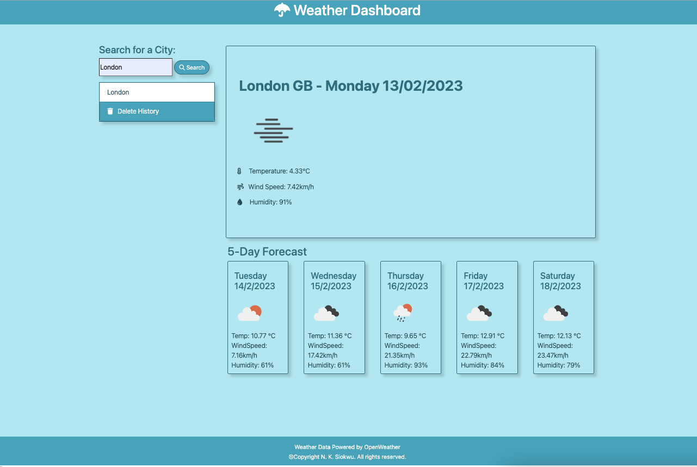
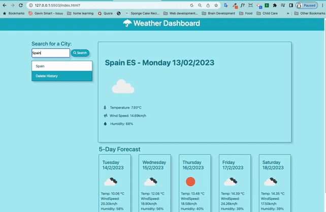

# Weather Dashboard

  

  ## Description
  This web application is a dynamic weather dashboard that provides the current weather conditions and a 5 day forecast for a city entered by the user. It uses the OpenWeatherMap API to request and display the city, country initials, temperature, wind speed and humidity to the user. The application stores the users search history in local storage and displays it on the UI for easy access. The user has the option to delete the search history with one click. The application is designed to be sleek and responsive.

  ## Table of Contents
  * [Technologies](#technologies)
  * [Installation](#installation)
  * [Usage](#usage)
  * [license](#license)
  * [Contributing](#contributing)
  * [Questions](#questions)
  * [Tests](#tests)
  
 
  ## Installation 
  N/A

  ## Usage
  Type in a city name and click the search button or hit the enter button then the page will be populated with the current weather conditions of the city, and a 5 day forecast for that city. Each location searched gets saved on the page and a click on either of the saved locations will perform a search for that location and it's weather details will replace the previous search details.

  ## Screenshot
  

  ## Demo
  

  ## License
  This project is licensed under the GNU GPL General Public License v3.0. [View licence](https://www.gnu.org/licenses/gpl-3.0)

  ## Contributing
  You are welcome to contribute to this project

  ## Questions
  Do you have any questions? Would you like to collaborate on a project?
  * Checkout my [github](https://github.com/ladykays)
  * Send me an [email](mailto:me@yahoo.com).

  ## Tests
  N/A

  ## Technologies Used
  * HTML  
* CSS  
* JavaScript  
* jQuery  
* Bootstrap  
* Other 

